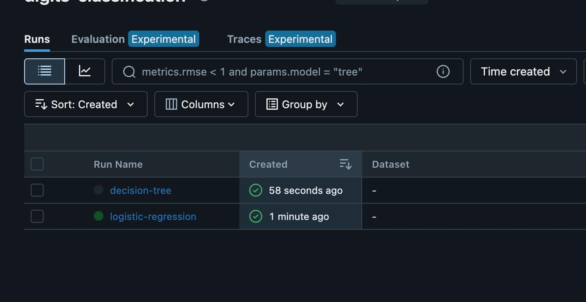
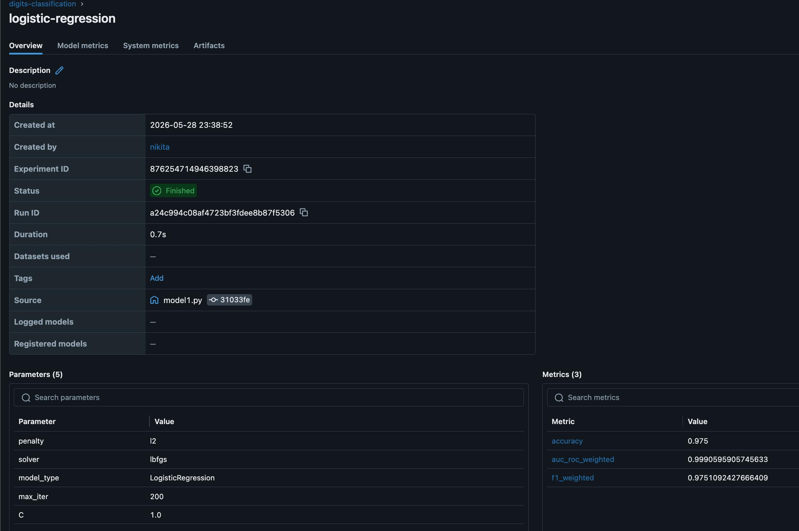
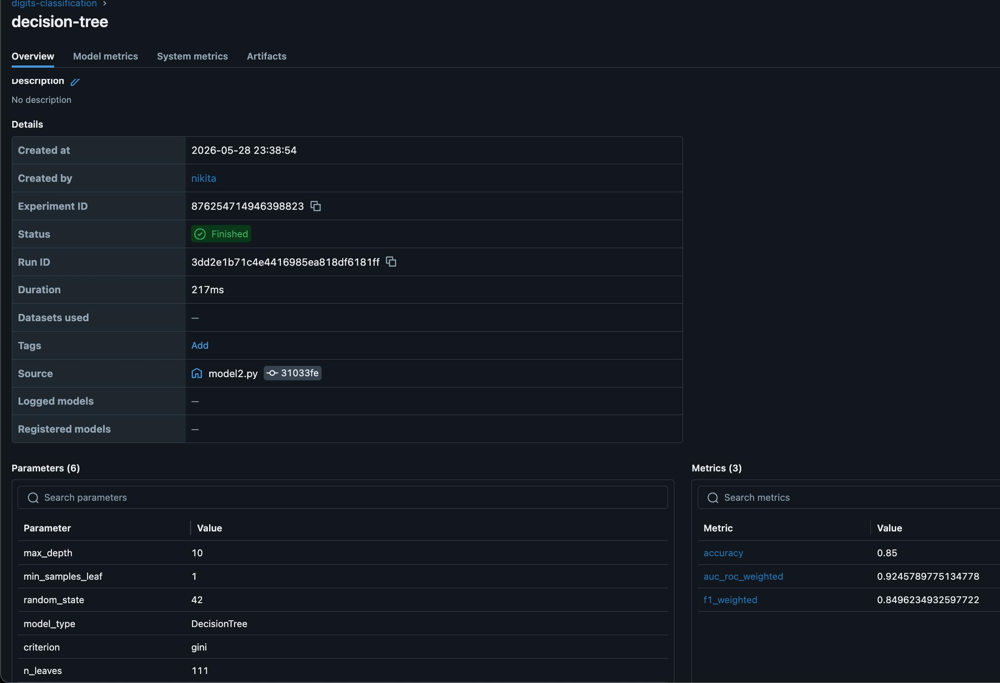
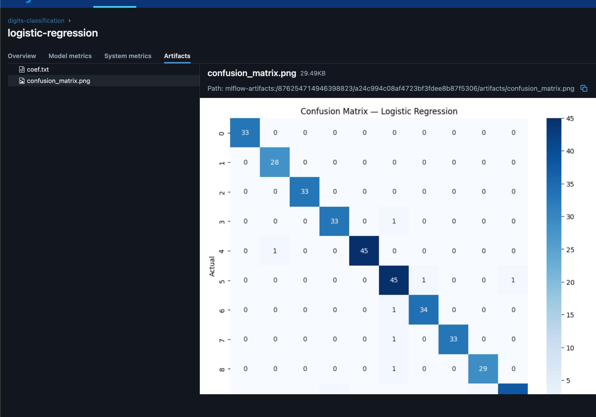

# mlops_4_tracking

## Models

- **model1.py** — Logistic Regression
- **model2.py** — Decision Tree

## Model Parameters

### Logistic Regression

| Parameter | Value |
|-----------|-------|
| C (regularization) | 1.0 |
| penalty | l2 |
| solver | lbfgs |
| max_iter | 200 |

### Decision Tree

| Parameter | Value |
|-----------|-------|
| max_depth | 10 |
| criterion | gini |
| min_samples_leaf | 1 |
| random_state | 42 |

## Results Comparison

| Metric | Logistic Regression | Decision Tree |
|--------|--------------------:|-------------:|
| Accuracy | **0.9750** | 0.8500 |
| F1 (weighted) | **0.9751** | 0.8496 |
| AUC-ROC (weighted) | **0.9991** | 0.9246 |

## Model Selection

Logistic Regression is the better model for this task.

## MLflow Experiments

### Experiment Overview

### Logistic Regression Run

### Decision Tree Run

### Logistic Regression Artifacts

